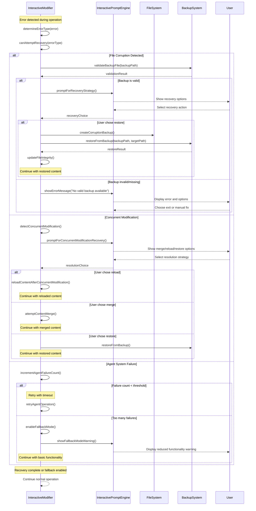
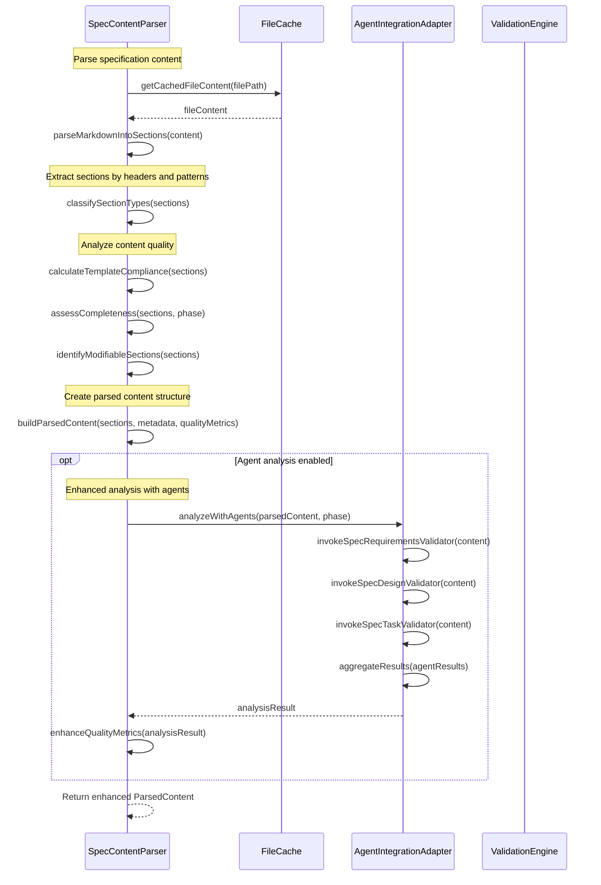

# Interactive Mode Technical Documentation

This document provides comprehensive technical documentation for the interactive spec-modify mode, including component architecture, interfaces, sequence diagrams, and extension guides for developers working with the system.

## Table of Contents

1. [Architecture Overview](#architecture-overview)
2. [Core Components](#core-components)
3. [Data Models and Interfaces](#data-models-and-interfaces)
4. [Sequence Diagrams](#sequence-diagrams)
5. [Integration Points](#integration-points)
6. [Extension Guide](#extension-guide)
7. [Error Handling Architecture](#error-handling-architecture)
8. [Performance Considerations](#performance-considerations)
9. [Testing Framework](#testing-framework)
10. [Development Guidelines](#development-guidelines)

## Architecture Overview

The interactive spec-modify mode follows a layered architecture pattern with clear separation of concerns:

```
┌─────────────────────────────────────────────────────────────────────────────┐
│                              CLI Layer                                      │
├─────────────────────────────────────────────────────────────────────────────┤
│                         InteractiveModifier                                 │
│                        (Orchestration Layer)                               │
├─────────────────────────────────────────────────────────────────────────────┤
│  SpecContentParser  │  MenuFactory  │  PromptEngine  │  PreviewEngine      │
│  (Content Analysis) │  (UI Logic)   │  (User I/O)    │  (Change Mgmt)      │
├─────────────────────────────────────────────────────────────────────────────┤
│            AgentAdapter            │         SpecStateDetector              │
│         (AI Integration)           │        (State Management)              │
├─────────────────────────────────────────────────────────────────────────────┤
│                            Foundation Layer                                 │
│      FileCache │ Git Utils │ Template System │ Backup System              │
└─────────────────────────────────────────────────────────────────────────────┘
```

### Design Principles

- **Single Responsibility**: Each component handles one specific aspect of the workflow
- **Dependency Inversion**: Higher-level components depend on abstractions, not implementations  
- **Error Recovery**: Comprehensive error handling with graceful degradation
- **Extensibility**: Plugin-like architecture for adding new actions and phases
- **Performance**: Efficient memory usage and responsive user interactions

## Core Components

### InteractiveModifier

**Location**: `src/spec-workflow/InteractiveModifier.ts`

**Purpose**: Main orchestration component that coordinates all interactive modification workflows.

#### Key Responsibilities
- Session lifecycle management
- Component coordination and dependency injection
- Error handling and recovery orchestration
- State management and persistence
- Concurrent modification detection

#### Core Interfaces

```typescript
interface InteractiveModifierOptions {
  enableAgentAnalysis?: boolean;        // Enable AI-powered suggestions
  agentTimeout?: number;                // Timeout for agent operations (ms)
  enableBackups?: boolean;              // Automatic backup creation
  userPermissions?: UserPermissions;    // User access controls
  restrictions?: string[];              // Additional modification restrictions
  verbose?: boolean;                    // Debug logging
  errorRecovery?: ErrorRecoveryOptions; // Error handling configuration
  enableConcurrentDetection?: boolean;  // File change monitoring
  concurrentCheckInterval?: number;     // Check interval (ms)
}

interface SessionState {
  specName: string;                     // Target specification
  phase: SpecPhase;                     // Current phase being modified
  filePath: string;                     // Target file path
  parsedContent: ParsedContent | null;  // Current content structure
  currentMenu: ModificationMenu | null; // Active menu state
  agentAnalysis: AnalysisResult | null; // AI analysis results
  specState: SpecState | null;          // Specification state
  sessionStart: Date;                   // Session start timestamp
  isActive: boolean;                    // Session status
  sessionErrors: string[];              // Error accumulation
  fileIntegrity: FileIntegrity | null;  // Concurrent modification tracking
  recoveryAttempts: number;             // Error recovery counter
  currentBackupPath: string | null;     // Current backup location
  agentFailureCount: number;            // AI failure tracking
  fallbackMode: boolean;                // Degraded functionality mode
  lastErrorType: ErrorType | null;      // Last error for recovery decisions
  concurrentCheckTimer: NodeJS.Timeout | null; // File monitoring timer
}
```

#### Key Methods

```typescript
async startInteractiveSession(specName: string, phase: SpecPhase): Promise<boolean>
async handleModificationWorkflow(parsedContent: ParsedContent, agentAnalysis: AnalysisResult | null): Promise<boolean>
async analyzeSpecificationState(): Promise<SpecState>
validatePhaseModification(requestedPhase: SpecPhase, specState: SpecState): boolean
```

### SpecContentParser

**Location**: `src/spec-workflow/SpecContentParser.ts`

**Purpose**: Parses and analyzes specification files into structured, modifiable sections.

#### Core Functionality
- Markdown parsing into logical sections
- Content quality analysis and metrics calculation
- Template compliance validation
- Section type classification and modification permissions

#### Key Interfaces

```typescript
interface ParsedContent {
  phase: SpecPhase;                    // Target phase
  sections: ContentSection[];          // Parsed content sections
  metadata: ContentMetadata;           // File metadata
  qualityMetrics: QualityMetrics;      // Quality assessment
  rawContent: string;                  // Original file content
  parseSuccess: boolean;               // Parse operation status
  parseErrors: string[];               // Parse error details
}

interface ContentSection {
  id: string;                          // Unique section identifier
  title: string;                       // Display title
  content: string;                     // Section content
  sectionType: SectionType;            // Classification
  modifiable: boolean;                 // Edit permissions
  lineRange: [number, number];         // File line range
}
```

#### Key Methods

```typescript
async parseSpecContent(filePath: string, phase: SpecPhase): Promise<ParsedContent>
analyzeContentQuality(content: ParsedContent): ContentQualityReport
extractModifiableSections(content: ParsedContent): ModifiableSection[]
```

### ModificationMenuFactory

**Location**: `src/spec-workflow/ModificationMenuFactory.ts`

**Purpose**: Creates dynamic, phase-specific modification menus with AI-powered suggestions.

#### Core Functionality
- Phase-specific menu generation
- AI suggestion integration
- Permission-based action filtering
- Dynamic menu updates based on content analysis

#### Key Interfaces

```typescript
interface ModificationMenu {
  phase: SpecPhase;                    // Target phase
  actions: ModificationAction[];       // Available actions
  suggestions: Suggestion[];           // AI recommendations
  restrictions: string[];              // Applied restrictions
}

interface ModificationAction {
  id: string;                          // Action identifier
  label: string;                       // Display label
  description: string;                 // Action description
  requiresApproval: boolean;           // Approval requirement
  targetSection?: string;              // Target section (if applicable)
  actionType: 'add' | 'modify' | 'delete' | 'reorder'; // Action type
}

interface MenuGenerationContext {
  specName: string;                    // Specification name
  phaseStatus: ValidationStatus;       // Current validation status
  approved: boolean;                   // Approval status
  lastModified: Date;                  // Last modification time
  userPermissions: UserPermissions;    // User access rights
  availableSections: SectionType[];    // Modifiable section types
  restrictions: string[];              // Applied restrictions
  specificationState?: SpecState;      // Enhanced state information
  suggestions?: Suggestion[];          // AI-generated suggestions
}
```

#### Key Methods

```typescript
createPhaseMenu(phase: SpecPhase, context: MenuGenerationContext): ModificationMenu
getAvailableActions(phase: SpecPhase, permissions: UserPermissions): ModificationAction[]
generateDynamicSuggestions(content: ParsedContent, analysisResult: AnalysisResult): Suggestion[]
```

### InteractivePromptEngine

**Location**: `src/spec-workflow/InteractivePromptEngine.ts`

**Purpose**: Handles all user interactions, prompts, and input collection with rich terminal UI.

#### Core Functionality
- Rich terminal UI with colored output and progress indicators
- Interactive menu navigation with keyboard shortcuts
- Form-based input collection with validation
- Change preview display with diff formatting
- Confirmation dialogs and error recovery prompts

#### Key Interfaces

```typescript
interface PromptOptions {
  enableKeyboardShortcuts?: boolean;   // Keyboard navigation
  showProgressIndicators?: boolean;    // Progress display
  colorOutput?: boolean;               // Colored terminal output
  maxMenuHeight?: number;              // Menu display height
  enableQuickSelection?: boolean;      // Number key selection
  timeoutMs?: number;                  // Input timeout
}

interface ModificationChoice {
  action: ModificationAction | null;   // Selected action
  suggestion?: Suggestion;             // Selected suggestion (if applicable)
  metadata?: Record<string, any>;      // Additional choice metadata
}
```

#### Key Methods

```typescript
showContentSections(sections: ContentSection[], metadata?: ContentMetadata, qualityMetrics?: QualityMetrics, specState?: SpecState): void
presentModificationMenu(menu: ModificationMenu): Promise<ModificationChoice>
collectModificationInput(action: ModificationAction): Promise<ModificationData>
confirmChanges(preview: ModificationPreview): Promise<boolean>
promptForConcurrentModificationRecovery(): Promise<string>
```

### PreviewEngine

**Location**: `src/spec-workflow/PreviewEngine.ts`

**Purpose**: Generates change previews, validates modifications, and applies changes atomically.

#### Core Functionality
- Diff generation with line-by-line change tracking
- Impact analysis across specification phases
- Validation using specialized AI agents
- Atomic file modifications with backup creation
- Risk assessment and safety recommendations

#### Key Interfaces

```typescript
interface ModificationPreview {
  original: ParsedContent;             // Original content
  modified: ParsedContent;             // Modified content
  changes: ChangeRecord[];             // Detailed change records
  impactAnalysis: ImpactAnalysis;      // Cross-phase impact
  validationResults: ValidationResult; // Validation status
  statistics: ModificationStatistics;  // Change statistics
  riskAssessment: RiskAssessment;      // Risk evaluation
  safeToApply: boolean;               // Safety recommendation
  previewId: string;                  // Unique preview identifier
  generatedAt: Date;                  // Generation timestamp
}

interface ChangeRecord {
  changeType: 'addition' | 'modification' | 'deletion'; // Change type
  section: string;                     // Target section
  beforeContent?: string;              // Original content
  afterContent?: string;               // New content
  lineNumbers: [number, number];       // File line range
  impactLevel: 'low' | 'medium' | 'high'; // Impact severity
}
```

#### Key Methods

```typescript
async generatePreview(original: ParsedContent, modifications: ModificationData[], options?: PreviewGenerationOptions): Promise<ModificationPreview>
async validateModifications(preview: ModificationPreview): Promise<ValidationResult>
async applyModifications(preview: ModificationPreview, filePath: string): Promise<ApplicationResult>
```

### AgentIntegrationAdapter

**Location**: `src/spec-workflow/AgentIntegrationAdapter.ts`

**Purpose**: Integrates with the 16 specialized AI agents for content analysis and suggestions.

#### Core Functionality
- Agent orchestration and load balancing
- Result aggregation and confidence scoring
- Fallback handling for agent failures
- Caching for performance optimization

#### Key Interfaces

```typescript
interface AnalysisResult {
  status: 'success' | 'partial' | 'failed'; // Analysis status
  analysisId: string;                  // Unique analysis identifier
  analyzedAt: Date;                    // Analysis timestamp
  qualityScore: number;                // Overall quality score (0-100)
  completenessScore: number;           // Completeness score (0-100)
  consistencyScore: number;            // Consistency score (0-100)
  issues: ValidationIssue[];           // Identified issues
  suggestions: Suggestion[];           // Improvement recommendations
  agentResults: AgentResult[];         // Individual agent results
  confidence: ValidationConfidence;    // Overall confidence assessment
}

interface Suggestion {
  id: string;                          // Suggestion identifier
  title: string;                       // Short title
  description: string;                 // Detailed description
  rationale: string;                   // Why this suggestion was made
  impact: ImpactAnalysis;              // Expected impact
  confidence: number;                  // Confidence score (0-100)
  agentSource: string;                 // Source agent identifier
  priority: 'critical' | 'high' | 'medium' | 'low'; // Priority level
  effort: 'minimal' | 'low' | 'medium' | 'high';    // Implementation effort
  category: 'completeness' | 'quality' | 'consistency' | 'best-practice'; // Category
}
```

#### Key Methods

```typescript
async analyzeWithAgents(content: ParsedContent, phase: SpecPhase): Promise<AnalysisResult>
async getSuggestions(analysisResult: AnalysisResult): Promise<Suggestion[]>
async validateWithAgents(modifications: ModificationData[]): Promise<ValidationResult>
```

## Data Models and Interfaces

### Core Type Definitions

#### SpecPhase
```typescript
type SpecPhase = 'requirements' | 'design' | 'tasks';
```

#### SectionType
```typescript
type SectionType = 'user-story' | 'acceptance-criteria' | 'architecture' | 'component' | 'task' | 'other';
```

#### ValidationStatus
```typescript
type ValidationStatus = 'pass' | 'warning' | 'error';
```

### User Permission System

```typescript
interface UserPermissions {
  canAdd: boolean;                     // Can add new content
  canModify: boolean;                  // Can modify existing content
  canDelete: boolean;                  // Can delete content
  canReorder: boolean;                 // Can reorder elements
  canApprove: boolean;                 // Can approve changes
  allowedPhases: SpecPhase[];          // Phases user can modify
  restrictedSections: SectionType[];   // Sections user cannot modify
}
```

### Error Handling Types

```typescript
enum ErrorType {
  FILE_CORRUPTION = 'FILE_CORRUPTION',
  CONCURRENT_MODIFICATION = 'CONCURRENT_MODIFICATION', 
  AGENT_FAILURE = 'AGENT_FAILURE',
  VALIDATION_FAILURE = 'VALIDATION_FAILURE',
  BACKUP_FAILURE = 'BACKUP_FAILURE',
  PERMISSION_DENIED = 'PERMISSION_DENIED',
  SESSION_TIMEOUT = 'SESSION_TIMEOUT'
}

interface ErrorRecoveryOptions {
  autoRecover: boolean;                // Automatic recovery attempts
  createBackup: boolean;               // Backup before recovery
  promptUser: boolean;                 // Interactive recovery prompts
  enableFallback: boolean;             // Fallback to basic functionality
  maxRetries: number;                  // Maximum recovery attempts
}
```

## Sequence Diagrams

### Main Interactive Session Flow

```mermaid
sequenceDiagram
    participant User
    participant CLI as Enhanced SpecModifyCommand
    participant IM as InteractiveModifier
    participant CP as SpecContentParser
    participant MF as ModificationMenuFactory
    participant PE as InteractivePromptEngine
    participant Agents as AgentIntegrationAdapter
    participant PV as PreviewEngine
    participant SD as SpecStateDetector

    User->>CLI: /spec-modify spec-name phase -i
    CLI->>IM: startInteractiveSession(spec-name, phase)
    
    Note over IM: Initialize session state
    IM->>IM: buildSpecFilePath()
    IM->>IM: initializeFileIntegrity()
    IM->>IM: createSessionBackup()
    
    Note over IM: Analyze specification state
    IM->>SD: new SpecStateDetector(specName)
    IM->>SD: analyzeState()
    SD-->>IM: specState
    IM->>IM: validatePhaseModification()
    
    Note over IM: Parse and analyze content
    IM->>CP: parseSpecContent(filePath, phase)
    CP-->>IM: parsedContent
    
    Note over IM: Run agent analysis
    IM->>Agents: analyzeWithAgents(parsedContent, phase)
    Agents-->>IM: analysisResult
    
    Note over IM: Display content and start workflow
    IM->>PE: showContentSections(sections, metadata, qualityMetrics, specState)
    PE-->>User: Display formatted content with metrics
    
    Note over IM: Main modification loop
    loop Continue Modifying
        Note over IM: Generate modification menu
        IM->>MF: createPhaseMenu(phase, context)
        MF-->>IM: menu
        
        Note over IM: Present menu and collect choice
        IM->>PE: presentModificationMenu(menu)
        PE-->>User: Show interactive menu
        User-->>PE: Select action
        PE-->>IM: userChoice
        
        alt User chose to exit
            Note over IM: Exit workflow
            IM->>IM: cleanup()
            break
        end
        
        Note over IM: Collect modification input
        IM->>PE: collectModificationInput(action)
        PE-->>User: Show guided input form
        User-->>PE: Provide input
        PE-->>IM: modificationData
        
        Note over IM: Generate and show preview
        IM->>PV: generatePreview(parsedContent, [modificationData])
        PV-->>IM: preview
        IM->>PE: confirmChanges(preview)
        PE-->>User: Show change preview
        User-->>PE: Confirm/Cancel
        PE-->>IM: confirmed
        
        alt User confirmed changes
            Note over IM: Apply modifications
            IM->>PV: applyModifications(preview, filePath)
            PV-->>IM: applicationResult
            
            alt Application successful
                IM->>IM: updateFileIntegrity()
                Note over IM: Re-parse updated content
                IM->>CP: parseSpecContent(filePath, phase)
                CP-->>IM: updatedContent
            end
        end
    end
    
    Note over IM: Session cleanup
    IM->>IM: cleanup()
    IM-->>CLI: sessionSuccess
    CLI-->>User: Session complete
```

### Error Recovery Flow



### Content Parsing and Analysis Flow



## Integration Points

### File System Integration

The interactive mode integrates with the existing file system utilities:

- **File Caching**: Uses `src/file-cache.ts` for efficient content loading
- **Backup System**: Integrates with existing backup mechanisms
- **Git Integration**: Leverages `src/git.ts` for version control awareness

### Agent System Integration

Seamless integration with the 16 specialized agents:

```typescript
// Agent invocation patterns
const agents = {
  'spec-requirements-validator': 'Validates requirements phase content',
  'spec-design-validator': 'Validates design phase consistency',
  'spec-task-validator': 'Validates task atomicity and completeness',
  'spec-completion-reviewer': 'Reviews overall specification completeness',
  'spec-dependency-analyzer': 'Analyzes cross-phase dependencies',
  'spec-breaking-change-detector': 'Detects potentially breaking changes'
  // ... additional agents
};

// Agent integration example
async function validateWithAgents(content: ParsedContent, phase: SpecPhase): Promise<ValidationResult> {
  const relevantAgents = getAgentsForPhase(phase);
  const results = await Promise.allSettled(
    relevantAgents.map(agent => invokeAgent(agent, content))
  );
  return aggregateValidationResults(results);
}
```

### Dashboard Integration

Interactive mode provides real-time updates to the dashboard:

```typescript
// WebSocket integration for real-time updates
interface DashboardUpdate {
  type: 'session_start' | 'modification_applied' | 'validation_complete' | 'error_occurred';
  sessionId: string;
  specName: string;
  phase: SpecPhase;
  data: any;
  timestamp: Date;
}

// Dashboard update example
function sendDashboardUpdate(update: DashboardUpdate): void {
  if (dashboardWebSocket && dashboardWebSocket.readyState === WebSocket.OPEN) {
    dashboardWebSocket.send(JSON.stringify(update));
  }
}
```

### Template System Integration

Leverages existing template system for guided input:

```typescript
// Template integration example
interface TemplateDefinition {
  phase: SpecPhase;
  sectionType: SectionType;
  fields: TemplateField[];
  validation: ValidationRule[];
}

interface TemplateField {
  name: string;
  type: 'text' | 'select' | 'multiline' | 'number';
  required: boolean;
  placeholder: string;
  options?: string[];
  validation?: string; // regex pattern
}
```

## Extension Guide

### Adding New Modification Actions

To add new modification actions for existing phases:

1. **Define the Action**:
```typescript
// In ModificationMenuFactory.ts
const newAction: ModificationAction = {
  id: 'add-api-endpoint',
  label: 'Add API Endpoint',
  description: 'Define a new REST API endpoint',
  requiresApproval: true,
  targetSection: 'api-specification',
  actionType: 'add'
};
```

2. **Implement Input Collection**:
```typescript
// In InteractivePromptEngine.ts
async collectApiEndpointInput(): Promise<ModificationData> {
  const endpoint = await inquirer.prompt([
    {
      type: 'input',
      name: 'path',
      message: 'API endpoint path (e.g., /api/users):',
      validate: (input) => input.startsWith('/') || 'Path must start with /'
    },
    {
      type: 'list',
      name: 'method',
      message: 'HTTP method:',
      choices: ['GET', 'POST', 'PUT', 'DELETE', 'PATCH']
    }
  ]);
  
  return {
    actionType: 'add',
    targetSection: 'api-specification',
    content: generateApiEndpointContent(endpoint),
    metadata: { endpoint }
  };
}
```

3. **Add Preview Logic**:
```typescript
// In PreviewEngine.ts
generateApiEndpointPreview(modification: ModificationData): ChangeRecord[] {
  return [{
    changeType: 'addition',
    section: 'API Specifications',
    afterContent: modification.content,
    lineNumbers: [findInsertionPoint(), findInsertionPoint() + countLines(modification.content)],
    impactLevel: 'medium'
  }];
}
```

### Adding New Phases

To support additional specification phases:

1. **Extend Type Definitions**:
```typescript
// In types/ParsedContent.ts
type SpecPhase = 'requirements' | 'design' | 'tasks' | 'deployment' | 'testing';
```

2. **Create Phase-Specific Parser**:
```typescript
// In SpecContentParser.ts
parseDeploymentContent(content: string): ContentSection[] {
  // Implementation for parsing deployment specifications
  return sections;
}
```

3. **Add Menu Factory Support**:
```typescript
// In ModificationMenuFactory.ts
createDeploymentMenu(context: MenuGenerationContext): ModificationMenu {
  return {
    phase: 'deployment',
    actions: [
      {
        id: 'add-environment',
        label: 'Add Environment',
        description: 'Define deployment environment',
        requiresApproval: true,
        actionType: 'add'
      }
      // ... additional actions
    ],
    suggestions: context.suggestions || [],
    restrictions: context.restrictions
  };
}
```

### Adding New Agent Integrations

To integrate additional specialized agents:

1. **Define Agent Interface**:
```typescript
// In AgentIntegrationAdapter.ts
interface DeploymentAnalysisAgent {
  analyzeDeploymentConfig(config: DeploymentConfig): Promise<DeploymentAnalysisResult>;
  validateEnvironmentSetup(environment: Environment): Promise<ValidationResult>;
  suggestOptimizations(deployment: ParsedContent): Promise<Suggestion[]>;
}
```

2. **Implement Agent Adapter**:
```typescript
async analyzeDeploymentSpecification(content: ParsedContent): Promise<AnalysisResult> {
  const agent = new DeploymentAnalysisAgent();
  
  try {
    const results = await Promise.allSettled([
      agent.analyzeDeploymentConfig(extractDeploymentConfig(content)),
      agent.validateEnvironmentSetup(extractEnvironments(content)),
      agent.suggestOptimizations(content)
    ]);
    
    return aggregateResults(results);
  } catch (error) {
    return createErrorResult(error);
  }
}
```

3. **Register Agent**:
```typescript
// In AgentIntegrationAdapter.ts constructor
this.availableAgents.set('spec-deployment-analyzer', {
  name: 'Deployment Specification Analyzer',
  description: 'Analyzes deployment configurations and environments',
  supportedPhases: ['deployment'],
  priority: 1
});
```

### Custom Validation Rules

To add custom validation rules:

1. **Define Validation Rule**:
```typescript
interface CustomValidationRule {
  id: string;
  name: string;
  description: string;
  phase: SpecPhase;
  validate: (content: ParsedContent) => ValidationIssue[];
}
```

2. **Implement Rule Logic**:
```typescript
const apiVersioningRule: CustomValidationRule = {
  id: 'api-versioning-required',
  name: 'API Versioning Required',
  description: 'All API endpoints must specify version',
  phase: 'design',
  validate: (content: ParsedContent) => {
    const issues: ValidationIssue[] = [];
    
    content.sections
      .filter(s => s.sectionType === 'api-specification')
      .forEach(section => {
        if (!section.content.includes('/v1/') && !section.content.includes('/v2/')) {
          issues.push({
            severity: 'warning',
            message: 'API endpoint missing version specification',
            location: section.lineRange,
            suggestion: 'Add version prefix (e.g., /v1/) to API path'
          });
        }
      });
    
    return issues;
  }
};
```

3. **Register Rule**:
```typescript
// In PreviewEngine.ts or validation system
this.customValidationRules.push(apiVersioningRule);
```

### Error Recovery Extensions

To add custom error recovery strategies:

1. **Define Recovery Strategy**:
```typescript
interface CustomRecoveryStrategy {
  errorType: ErrorType;
  canHandle: (error: Error, context: SessionState) => boolean;
  recover: (error: Error, context: SessionState) => Promise<boolean>;
  priority: number;
}
```

2. **Implement Strategy**:
```typescript
const networkErrorRecovery: CustomRecoveryStrategy = {
  errorType: ErrorType.AGENT_FAILURE,
  canHandle: (error: Error, context: SessionState) => {
    return error.message.includes('ECONNREFUSED') || 
           error.message.includes('TIMEOUT');
  },
  recover: async (error: Error, context: SessionState) => {
    // Implement network-specific recovery logic
    console.log('🔄 Network error detected, retrying with exponential backoff...');
    
    for (let attempt = 1; attempt <= 3; attempt++) {
      await sleep(1000 * Math.pow(2, attempt));
      try {
        // Retry the operation
        return true;
      } catch (retryError) {
        if (attempt === 3) throw retryError;
      }
    }
    return false;
  },
  priority: 1
};
```

3. **Register Strategy**:
```typescript
// In InteractiveModifier.ts
this.customRecoveryStrategies.push(networkErrorRecovery);
```

## Error Handling Architecture

### Error Classification System

```typescript
enum ErrorSeverity {
  INFORMATIONAL = 'informational',
  WARNING = 'warning',
  ERROR = 'error',
  CRITICAL = 'critical'
}

enum ErrorCategory {
  PARSING = 'parsing',
  VALIDATION = 'validation',
  IO_OPERATION = 'io_operation',
  AGENT_COMMUNICATION = 'agent_communication',
  USER_INPUT = 'user_input',
  SYSTEM_STATE = 'system_state'
}

interface ErrorDetails {
  type: ErrorType;
  severity: ErrorSeverity;
  category: ErrorCategory;
  message: string;
  context: any;
  timestamp: Date;
  sessionId: string;
  recoverable: boolean;
  suggestedActions: string[];
}
```

### Recovery Strategy Framework

```typescript
abstract class RecoveryStrategy {
  abstract canHandle(error: ErrorDetails): boolean;
  abstract execute(error: ErrorDetails, session: SessionState): Promise<RecoveryResult>;
  abstract getPriority(): number;
}

interface RecoveryResult {
  success: boolean;
  message: string;
  newState?: Partial<SessionState>;
  requiresUserInput?: boolean;
  retryable?: boolean;
}

class RecoveryManager {
  private strategies: RecoveryStrategy[] = [];
  
  register(strategy: RecoveryStrategy): void {
    this.strategies.push(strategy);
    this.strategies.sort((a, b) => b.getPriority() - a.getPriority());
  }
  
  async handleError(error: ErrorDetails, session: SessionState): Promise<RecoveryResult> {
    for (const strategy of this.strategies) {
      if (strategy.canHandle(error)) {
        try {
          return await strategy.execute(error, session);
        } catch (strategyError) {
          console.warn(`Recovery strategy failed: ${strategyError.message}`);
        }
      }
    }
    
    return {
      success: false,
      message: 'No suitable recovery strategy found',
      retryable: false
    };
  }
}
```

### Graceful Degradation Framework

```typescript
interface FallbackConfiguration {
  disableAgentAnalysis: boolean;
  reduceMemoryUsage: boolean;
  simplifyValidation: boolean;
  disableBackups: boolean;
  limitPreviewSize: boolean;
}

class GracefulDegradationManager {
  private currentConfiguration: FallbackConfiguration = {
    disableAgentAnalysis: false,
    reduceMemoryUsage: false,
    simplifyValidation: false,
    disableBackups: false,
    limitPreviewSize: false
  };
  
  degradeCapability(capability: keyof FallbackConfiguration, reason: string): void {
    this.currentConfiguration[capability] = true;
    console.warn(`⬇️  Degrading capability '${capability}': ${reason}`);
  }
  
  isCapabilityEnabled(capability: keyof FallbackConfiguration): boolean {
    return !this.currentConfiguration[capability];
  }
}
```

## Performance Considerations

### Memory Management

#### Memory Usage Tracking

```typescript
interface MemoryUsageTracker {
  sessionStart: number;         // Memory at session start
  current: number;             // Current memory usage
  peak: number;                // Peak usage during session
  limit: number;               // Configured limit (50MB)
  warnings: number;            // Number of warnings issued
}

class MemoryMonitor {
  private tracker: MemoryUsageTracker;
  
  startMonitoring(): void {
    const initialMemory = process.memoryUsage().heapUsed;
    this.tracker = {
      sessionStart: initialMemory,
      current: initialMemory,
      peak: initialMemory,
      limit: 50 * 1024 * 1024, // 50MB
      warnings: 0
    };
    
    // Monitor every 10 seconds
    setInterval(() => this.checkMemoryUsage(), 10000);
  }
  
  private checkMemoryUsage(): void {
    const currentMemory = process.memoryUsage().heapUsed;
    const sessionUsage = currentMemory - this.tracker.sessionStart;
    
    this.tracker.current = sessionUsage;
    this.tracker.peak = Math.max(this.tracker.peak, sessionUsage);
    
    if (sessionUsage > this.tracker.limit * 0.8) {
      this.issueMemoryWarning(sessionUsage);
    }
  }
}
```

#### Content Streaming for Large Files

```typescript
interface StreamingParseOptions {
  maxChunkSize: number;        // Maximum chunk size in bytes
  overlapLines: number;        // Lines to overlap between chunks
  progressCallback?: (progress: number) => void;
}

class StreamingContentParser {
  async parseContentStream(
    filePath: string, 
    options: StreamingParseOptions
  ): Promise<ParsedContent> {
    const fileSize = statSync(filePath).size;
    
    if (fileSize < 1024 * 1024) { // < 1MB, parse normally
      return this.parseContentNormally(filePath);
    }
    
    // Stream parsing for large files
    return this.parseContentInChunks(filePath, options);
  }
  
  private async parseContentInChunks(
    filePath: string, 
    options: StreamingParseOptions
  ): Promise<ParsedContent> {
    const chunks: ContentSection[] = [];
    // Implementation for chunk-based parsing
    return this.mergeParsedChunks(chunks);
  }
}
```

### Response Time Optimization

#### Caching Strategy

```typescript
interface CacheEntry<T> {
  data: T;
  timestamp: Date;
  hits: number;
  maxAge: number;
}

class ResponseCache<T> {
  private cache = new Map<string, CacheEntry<T>>();
  
  set(key: string, data: T, maxAge: number = 300000): void { // 5 minutes default
    this.cache.set(key, {
      data,
      timestamp: new Date(),
      hits: 0,
      maxAge
    });
  }
  
  get(key: string): T | null {
    const entry = this.cache.get(key);
    if (!entry) return null;
    
    const age = Date.now() - entry.timestamp.getTime();
    if (age > entry.maxAge) {
      this.cache.delete(key);
      return null;
    }
    
    entry.hits++;
    return entry.data;
  }
}

// Usage for agent analysis results
const analysisCache = new ResponseCache<AnalysisResult>();

async function getCachedAnalysis(content: ParsedContent, phase: SpecPhase): Promise<AnalysisResult | null> {
  const cacheKey = `${phase}:${calculateContentHash(content)}`;
  return analysisCache.get(cacheKey);
}
```

#### Parallel Operations

```typescript
class ParallelOperationManager {
  async executeInParallel<T>(
    operations: (() => Promise<T>)[],
    maxConcurrency: number = 3
  ): Promise<T[]> {
    const results: T[] = [];
    const executing: Promise<void>[] = [];
    
    for (const operation of operations) {
      const promise = this.executeWithSemaphore(operation)
        .then(result => results.push(result));
      executing.push(promise);
      
      if (executing.length >= maxConcurrency) {
        await Promise.race(executing);
        executing.splice(executing.findIndex(p => p === promise), 1);
      }
    }
    
    await Promise.all(executing);
    return results;
  }
  
  private async executeWithSemaphore<T>(operation: () => Promise<T>): Promise<T> {
    // Semaphore logic to control concurrency
    return operation();
  }
}
```

### Database/State Persistence

For future extensions requiring persistence:

```typescript
interface PersistenceLayer {
  saveSessionState(sessionId: string, state: SessionState): Promise<void>;
  loadSessionState(sessionId: string): Promise<SessionState | null>;
  saveModificationHistory(specName: string, modifications: ModificationRecord[]): Promise<void>;
  getModificationHistory(specName: string, limit?: number): Promise<ModificationRecord[]>;
}

interface ModificationRecord {
  id: string;
  sessionId: string;
  specName: string;
  phase: SpecPhase;
  action: string;
  timestamp: Date;
  author: string;
  changes: ChangeRecord[];
  approved: boolean;
  approvedBy?: string;
  approvalTimestamp?: Date;
}
```

## Testing Framework

### Unit Testing Architecture

```typescript
// Example test structure for InteractiveModifier
describe('InteractiveModifier', () => {
  let modifier: InteractiveModifier;
  let mockContentParser: jest.Mocked<SpecContentParser>;
  let mockPromptEngine: jest.Mocked<InteractivePromptEngine>;
  
  beforeEach(() => {
    mockContentParser = createMockContentParser();
    mockPromptEngine = createMockPromptEngine();
    
    modifier = new InteractiveModifier({
      enableAgentAnalysis: false, // Disable for unit tests
      verbose: false
    });
    
    // Inject mocks
    modifier['contentParser'] = mockContentParser;
    modifier['promptEngine'] = mockPromptEngine;
  });
  
  describe('session management', () => {
    it('should initialize session with correct state', async () => {
      mockContentParser.parseSpecContent.mockResolvedValue(createMockParsedContent());
      
      const result = await modifier.startInteractiveSession('test-spec', 'requirements');
      
      expect(result).toBe(true);
      expect(modifier.getCurrentSession()).toMatchObject({
        specName: 'test-spec',
        phase: 'requirements',
        isActive: true
      });
    });
    
    it('should handle file corruption with backup recovery', async () => {
      const corruptContent = createCorruptedContent();
      mockContentParser.parseSpecContent
        .mockResolvedValueOnce(corruptContent)
        .mockResolvedValueOnce(createMockParsedContent());
      
      const result = await modifier.startInteractiveSession('test-spec', 'requirements');
      
      expect(result).toBe(true);
      // Verify backup recovery was attempted
      expect(mockContentParser.parseSpecContent).toHaveBeenCalledTimes(2);
    });
  });
  
  describe('error handling', () => {
    it('should gracefully degrade when agents fail', async () => {
      const modifier = new InteractiveModifier({
        enableAgentAnalysis: true,
        errorRecovery: { enableFallback: true }
      });
      
      // Mock agent failures
      const mockAgentAdapter = createMockAgentAdapter();
      mockAgentAdapter.analyzeWithAgents.mockRejectedValue(new Error('Agent timeout'));
      modifier['agentAdapter'] = mockAgentAdapter;
      
      const result = await modifier.startInteractiveSession('test-spec', 'requirements');
      
      expect(result).toBe(true);
      expect(modifier.getCurrentSession()?.fallbackMode).toBe(true);
    });
  });
});
```

### Integration Testing

```typescript
describe('Interactive Modification Workflow Integration', () => {
  let tempDir: string;
  let specPath: string;
  
  beforeEach(async () => {
    tempDir = await createTempDirectory();
    specPath = await createTestSpecification(tempDir, 'test-spec');
  });
  
  afterEach(async () => {
    await cleanupTempDirectory(tempDir);
  });
  
  it('should complete full modification workflow', async () => {
    const modifier = new InteractiveModifier({
      enableAgentAnalysis: false,
      enableBackups: true
    });
    
    // Mock user interactions
    const mockPromptEngine = createMockPromptEngine();
    mockPromptEngine.presentModificationMenu.mockResolvedValue({
      action: {
        id: 'add-user-story',
        label: 'Add User Story',
        description: 'Add new user story',
        requiresApproval: false,
        actionType: 'add'
      }
    });
    
    mockPromptEngine.collectModificationInput.mockResolvedValue({
      actionType: 'add',
      targetSection: 'user-stories',
      content: '## User Story: Test Story\nAs a test user...',
      metadata: {}
    });
    
    mockPromptEngine.confirmChanges.mockResolvedValue(true);
    
    modifier['promptEngine'] = mockPromptEngine;
    
    const result = await modifier.startInteractiveSession('test-spec', 'requirements');
    
    expect(result).toBe(true);
    
    // Verify file was modified
    const modifiedContent = await fs.readFile(path.join(specPath, 'requirements.md'), 'utf-8');
    expect(modifiedContent).toContain('## User Story: Test Story');
  });
});
```

### End-to-End Testing

```typescript
describe('Interactive Mode E2E Tests', () => {
  it('should handle complete user workflow', async () => {
    // Create real test specification
    const testProject = await createTestProject();
    
    try {
      // Simulate user input sequence
      const inputSequence = [
        'u', // Add user story
        'Test User', // Persona
        'perform test action', // Goal
        'validate system behavior', // Benefit
        'y', // Confirm
        '0'  // Exit
      ];
      
      const result = await runInteractiveModeWithInput(
        testProject.specName,
        'requirements',
        inputSequence
      );
      
      expect(result.success).toBe(true);
      expect(result.modificationsApplied).toBeGreaterThan(0);
      
      // Verify actual file changes
      const requirementsContent = await readFile(testProject.requirementsPath);
      expect(requirementsContent).toContain('As a Test User');
      
    } finally {
      await cleanupTestProject(testProject);
    }
  });
});
```

## Development Guidelines

### Code Organization

```typescript
// Directory structure for extensions
src/
├── spec-workflow/
│   ├── core/              // Core orchestration components
│   │   ├── InteractiveModifier.ts
│   │   └── SessionManager.ts
│   ├── parsing/           // Content parsing components
│   │   ├── SpecContentParser.ts
│   │   └── SectionClassifier.ts
│   ├── ui/               // User interface components
│   │   ├── InteractivePromptEngine.ts
│   │   └── MenuRenderer.ts
│   ├── preview/          // Change preview and validation
│   │   ├── PreviewEngine.ts
│   │   └── DiffGenerator.ts
│   ├── agents/           // Agent integration
│   │   ├── AgentIntegrationAdapter.ts
│   │   └── AgentOrchestrator.ts
│   ├── extensions/       // Extension points
│   │   ├── ActionRegistry.ts
│   │   ├── PhaseExtensions.ts
│   │   └── ValidationExtensions.ts
│   └── types/           // Type definitions
│       ├── ParsedContent.ts
│       ├── ModificationMenu.ts
│       └── ModificationPreview.ts
```

### Coding Standards

#### TypeScript Best Practices

```typescript
// Use strict typing
interface StrictInterface {
  readonly requiredProperty: string;
  optionalProperty?: number;
}

// Prefer union types over enums when appropriate
type ActionType = 'add' | 'modify' | 'delete' | 'reorder';

// Use generic constraints
interface Repository<T extends { id: string }> {
  save(item: T): Promise<void>;
  findById(id: string): Promise<T | null>;
}

// Implement proper error handling
class CustomError extends Error {
  constructor(
    message: string,
    public readonly code: string,
    public readonly context?: any
  ) {
    super(message);
    this.name = 'CustomError';
  }
}
```

#### Async/Await Patterns

```typescript
// Prefer async/await over Promise chains
async function processModification(data: ModificationData): Promise<ApplicationResult> {
  try {
    const validation = await validateModification(data);
    if (!validation.isValid) {
      throw new ValidationError('Invalid modification', validation.errors);
    }
    
    const preview = await generatePreview(data);
    const result = await applyModification(preview);
    
    return result;
  } catch (error) {
    logger.error('Modification processing failed', { error, data });
    throw error;
  }
}

// Handle multiple async operations properly
async function processMultipleModifications(modifications: ModificationData[]): Promise<ApplicationResult[]> {
  // Process in parallel when safe
  const validations = await Promise.all(
    modifications.map(mod => validateModification(mod))
  );
  
  // Process sequentially when order matters
  const results: ApplicationResult[] = [];
  for (const modification of modifications) {
    const result = await applyModification(modification);
    results.push(result);
  }
  
  return results;
}
```

#### Error Handling Patterns

```typescript
// Use Result pattern for operations that can fail
type Result<T, E = Error> = 
  | { success: true; data: T }
  | { success: false; error: E };

async function safeParseContent(filePath: string): Promise<Result<ParsedContent>> {
  try {
    const content = await parseSpecContent(filePath);
    return { success: true, data: content };
  } catch (error) {
    return { 
      success: false, 
      error: error instanceof Error ? error : new Error(String(error))
    };
  }
}

// Use custom error types for specific scenarios
class ModificationError extends Error {
  constructor(
    message: string,
    public readonly modification: ModificationData,
    public readonly phase: SpecPhase
  ) {
    super(message);
    this.name = 'ModificationError';
  }
}
```

### Documentation Standards

#### Interface Documentation

```typescript
/**
 * Represents a modification action that can be performed on specification content.
 * 
 * @example
 * ```typescript
 * const addUserStoryAction: ModificationAction = {
 *   id: 'add-user-story',
 *   label: 'Add User Story',
 *   description: 'Create a new user story with guided prompts',
 *   requiresApproval: false,
 *   actionType: 'add'
 * };
 * ```
 */
interface ModificationAction {
  /** Unique identifier for the action */
  id: string;
  
  /** Human-readable label displayed in menus */
  label: string;
  
  /** Detailed description of what the action does */
  description: string;
  
  /** Whether this action requires stakeholder approval before application */
  requiresApproval: boolean;
  
  /** Optional target section for section-specific actions */
  targetSection?: string;
  
  /** Type of modification this action performs */
  actionType: 'add' | 'modify' | 'delete' | 'reorder';
}
```

#### Method Documentation

```typescript
/**
 * Generates a comprehensive preview of pending modifications.
 * 
 * This method creates a detailed preview showing exactly what changes will be made,
 * including line-by-line diffs, impact analysis, and validation results. The preview
 * provides all information needed for users to make informed decisions.
 * 
 * @param original - The original parsed content before modifications
 * @param modifications - Array of modification data to be applied
 * @param options - Configuration options for preview generation
 * @returns Promise resolving to complete modification preview
 * 
 * @throws {ValidationError} When modifications fail validation checks
 * @throws {PreviewGenerationError} When preview generation fails
 * 
 * @example
 * ```typescript
 * const preview = await previewEngine.generatePreview(
 *   originalContent,
 *   [addUserStoryModification],
 *   { includeDetailedDiff: true, performValidation: true }
 * );
 * 
 * if (preview.safeToApply) {
 *   await applyModifications(preview);
 * }
 * ```
 */
async generatePreview(
  original: ParsedContent,
  modifications: ModificationData[],
  options?: PreviewGenerationOptions
): Promise<ModificationPreview>
```

### Contribution Guidelines

#### Pull Request Template

```markdown
## Description
Brief description of the changes and their purpose.

## Type of Change
- [ ] Bug fix
- [ ] New feature
- [ ] Breaking change
- [ ] Documentation update
- [ ] Performance improvement

## Testing
- [ ] Unit tests added/updated
- [ ] Integration tests added/updated
- [ ] E2E tests added/updated
- [ ] Manual testing completed

## Architecture Impact
- [ ] New components added
- [ ] Existing interfaces modified
- [ ] Performance implications considered
- [ ] Error handling updated

## Documentation
- [ ] Code comments updated
- [ ] API documentation updated
- [ ] User documentation updated
- [ ] Architecture diagrams updated

## Checklist
- [ ] Code follows project standards
- [ ] Tests pass locally
- [ ] No breaking changes (or properly documented)
- [ ] Memory usage remains within limits
- [ ] Error scenarios handled appropriately
```

#### Review Guidelines

1. **Code Quality Review**:
   - Verify TypeScript strict mode compliance
   - Check error handling completeness
   - Validate async/await usage patterns
   - Review memory management practices

2. **Architecture Review**:
   - Ensure separation of concerns
   - Verify dependency injection patterns
   - Check extension point compatibility
   - Validate error recovery mechanisms

3. **Performance Review**:
   - Memory usage impact assessment
   - Response time impact analysis
   - Caching strategy evaluation
   - Concurrent operation safety

4. **Testing Review**:
   - Test coverage adequacy
   - Edge case coverage
   - Integration test completeness
   - Error scenario testing

This technical documentation provides developers with comprehensive guidance for understanding, extending, and maintaining the interactive spec-modify mode system. The architecture supports robust error handling, performance optimization, and extensibility while maintaining clean separation of concerns and comprehensive testing coverage.