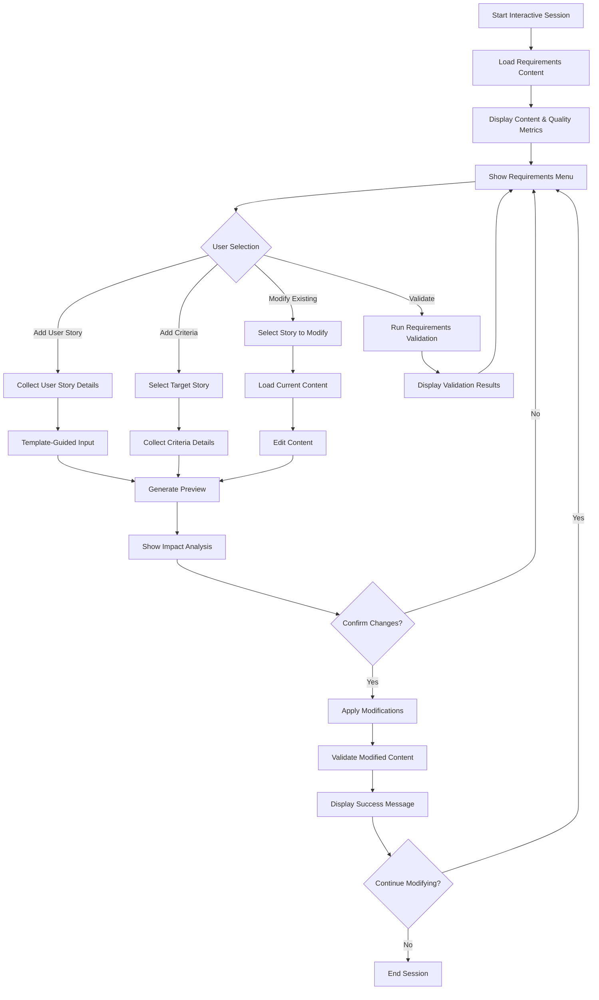
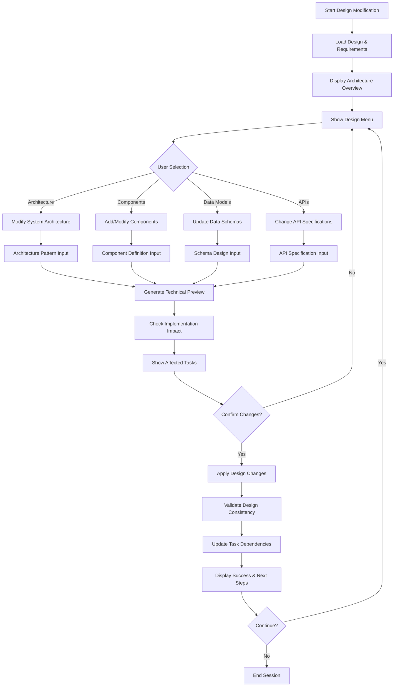
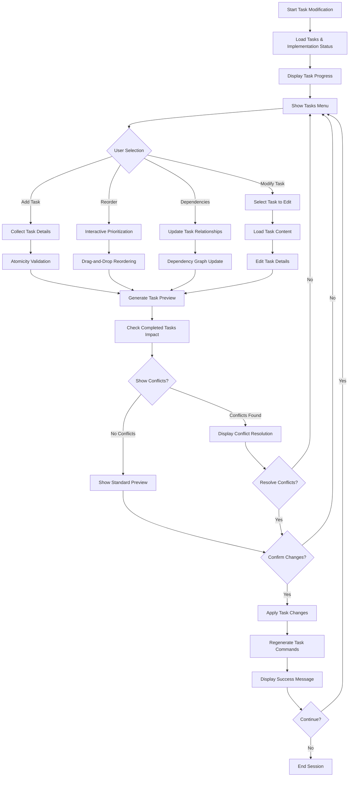

# Interactive Mode Usage Guide

This guide provides comprehensive instructions for using the interactive mode of the `spec-modify` command, which offers guided workflows for modifying specifications through intelligent menus and AI assistance.

## Table of Contents

1. [Getting Started](#getting-started)
2. [Menu Navigation](#menu-navigation)
3. [Keyboard Shortcuts](#keyboard-shortcuts)
4. [Workflow Diagrams](#workflow-diagrams)
5. [Phase-Specific Features](#phase-specific-features)
6. [AI Suggestions](#ai-suggestions)
7. [Change Management](#change-management)
8. [Troubleshooting](#troubleshooting)
9. [Advanced Features](#advanced-features)
10. [Best Practices](#best-practices)

## Getting Started

### Activating Interactive Mode

To enable interactive mode, add the `-i` flag to the `spec-modify` command:

```bash
/spec-modify <feature-name> <phase> -i
```

**Example:**
```bash
/spec-modify user-authentication requirements -i
```

### System Requirements

- Memory: Interactive mode uses up to 50MB additional memory
- Terminal: Requires TTY support for interactive prompts
- Permissions: Write access to specification files and backup directories

### Initial Setup Verification

The system will automatically check:
- ✅ Target specification exists
- ✅ Phase document is accessible
- ✅ User has modification permissions
- ✅ Agent system is available (optional)

## Menu Navigation

### Main Navigation Flow

```
Content Display → Menu Selection → Input Collection → Preview → Confirmation → Application
```

### Menu Structure

Interactive mode presents hierarchical menus with numbered options:

```
📄 Specification Content
├── 📊 Quality Metrics (compliance, completeness, validation status)
├── 📝 Content Sections (parsed and indexed)
└── 🔄 Specification State (phase progress, task status)

🛠️  Phase Modifications
├── 📋 Available Actions (phase-specific operations)
├── 💡 AI Suggestions (agent-generated recommendations) 
└── ⚙️  System Options (validation, backup, exit)
```

### Selection Methods

1. **Number Keys**: Press `1`, `2`, `3`, etc. to select menu items
2. **Arrow Keys**: Navigate up/down through options, press Enter to select
3. **Quick Keys**: Use shortcut letters when available (e.g., `u` for user story)
4. **Cancel**: Press `Ctrl+C` at any time to cancel operation

## Keyboard Shortcuts

### Global Shortcuts

| Key | Action |
|-----|--------|
| `Ctrl+C` | Cancel current operation and return to menu |
| `Esc` | Go back to previous menu level |
| `0` | Return to main menu / Exit |
| `?` | Show help and available shortcuts |

### Requirements Phase Shortcuts

| Key | Action | Description |
|-----|--------|-------------|
| `u` | Add User Story | Create new user story with guided prompts |
| `m` | Modify User Story | Edit existing user story content |
| `a` | Add Acceptance Criteria | Define new acceptance criteria |
| `c` | Modify Acceptance Criteria | Edit existing criteria |
| `b` | Add Business Rule | Define business rules and constraints |
| `s` | Define Success Metrics | Add measurable success criteria |
| `z` | Add Assumptions | Document assumptions and constraints |
| `r` | Reorder Requirements | Change priority and order |
| `d` | Delete Element | Remove requirements (with confirmation) |
| `v` | Validate | Run quality and completeness validation |

### Design Phase Shortcuts

| Key | Action | Description |
|-----|--------|-------------|
| `a` | Modify Architecture | Update system architecture patterns |
| `c` | Add Components | Define new system components |
| `m` | Modify Components | Edit existing component definitions |
| `d` | Update Data Models | Modify schemas and data structures |
| `p` | Change API Specs | Update REST/GraphQL definitions |
| `i` | Update Integrations | Modify external system integrations |
| `r` | Remove Elements | Delete design components |
| `v` | Validate Design | Run consistency checks |

### Tasks Phase Shortcuts

| Key | Action | Description |
|-----|--------|-------------|
| `n` | Add New Task | Create implementation tasks |
| `m` | Modify Task | Edit task descriptions/requirements |
| `p` | Re-prioritize | Change task order and priority |
| `d` | Update Dependencies | Modify task relationships |
| `a` | Improve Atomicity | Break down or combine tasks |
| `r` | Remove Tasks | Delete unnecessary tasks |
| `g` | Generate Commands | Create individual task command files |
| `v` | Validate Tasks | Check atomicity and completeness |

### Menu Navigation Shortcuts

| Key | Action |
|-----|--------|
| `Enter` | Confirm selection |
| `Space` | Toggle multi-select items |
| `Tab` | Move to next section |
| `Shift+Tab` | Move to previous section |

## Workflow Diagrams

### Requirements Phase Workflow



### Design Phase Workflow



### Tasks Phase Workflow



## Phase-Specific Features

### Requirements Phase Features

#### Content Analysis Display
- **User Stories**: Parsed and numbered with persona/goal/benefit structure
- **Acceptance Criteria**: Linked to parent user stories with GIVEN/WHEN/THEN format
- **Business Rules**: Extracted constraints and validation rules
- **Success Metrics**: Quantifiable success criteria and KPIs

#### Guided Input Forms
```
Adding User Story:
┌─────────────────────────────────────────────────────────────────────────────┐
│ As a [persona] (required)                                                   │
│ I want [goal] (required)                                                    │
│ So that [benefit] (required)                                               │
│                                                                             │
│ Priority: [High/Medium/Low] (default: Medium)                              │
│ Effort Estimate: [S/M/L/XL] (optional)                                     │
│ Related Requirements: [comma-separated] (optional)                         │
└─────────────────────────────────────────────────────────────────────────────┘
```

#### Quality Validation
- **Template Compliance**: Checks user story format, acceptance criteria structure
- **Completeness**: Verifies all required sections are present
- **Consistency**: Identifies conflicts between requirements
- **Traceability**: Ensures requirements link properly to acceptance criteria

### Design Phase Features

#### Architecture Visualization
- **Component Diagrams**: Visual representation of system components
- **Data Flow**: Shows how data moves through the system  
- **Integration Points**: External system connections and APIs
- **Technology Stack**: Languages, frameworks, and tools

#### Smart Component Management
```
Component Definition:
┌─────────────────────────────────────────────────────────────────────────────┐
│ Component Name: [string] (required)                                         │
│ Type: [Service/Module/Database/API/UI] (required)                          │
│ Description: [text] (required)                                             │
│                                                                             │
│ Dependencies: [select existing components] (optional)                      │
│ Interfaces: [define input/output] (optional)                              │
│ Technology: [select from standards] (optional)                            │
│ Performance Requirements: [text] (optional)                                │
└─────────────────────────────────────────────────────────────────────────────┘
```

#### Design Validation
- **Architecture Consistency**: Verifies components fit together properly
- **Technology Alignment**: Checks against tech.md standards
- **Performance Analysis**: Identifies potential bottlenecks
- **Integration Validation**: Ensures external systems are properly defined

### Tasks Phase Features

#### Task Atomicity Analysis
- **Single Purpose**: Each task focuses on one specific outcome
- **Time Bounded**: Tasks completable within defined time limits
- **Testable**: Clear success criteria and validation methods
- **Independent**: Minimal dependencies on other tasks

#### Implementation Status Tracking
```
Task Status Display:
┌─────────────────────────────────────────────────────────────────────────────┐
│ Task 1: Create user registration API endpoint        [✅ COMPLETED]        │
│ Task 2: Implement password validation logic          [🔄 IN PROGRESS]      │
│ Task 3: Create user profile database schema          [⏳ PENDING]          │
│ Task 4: Build registration form component            [⏳ PENDING]          │
│                                                                             │
│ Progress: 1/4 completed (25%)                                              │
│ Next: Task 2 - Implement password validation logic                        │
└─────────────────────────────────────────────────────────────────────────────┘
```

#### Smart Task Generation
- **Dependency Analysis**: Automatically suggests task ordering
- **Effort Estimation**: Provides time estimates based on complexity
- **Resource Planning**: Identifies required skills and tools
- **Command Generation**: Creates individual task command files

## AI Suggestions

### Suggestion Categories

#### Completeness Suggestions
```
💡 Missing Elements Detected:
   • No error handling specified for login failure
   • Password reset functionality not defined
   • Account lockout policy missing from business rules
```

#### Quality Improvements
```
💡 Quality Enhancement Opportunities:
   • User story "manage account" is too broad - consider splitting
   • Acceptance criteria missing edge cases (empty inputs, network failures)
   • API specification lacks error response definitions
```

#### Best Practice Recommendations
```
💡 Industry Best Practices:
   • Consider implementing OAuth 2.0 for authentication
   • Add rate limiting to prevent brute force attacks  
   • Include accessibility requirements for UI components
```

#### Consistency Fixes
```
💡 Consistency Issues Found:
   • Design uses "userId" but requirements refer to "user_id"
   • Task 5 depends on component not defined in design
   • Success metrics don't align with user story benefits
```

### Suggestion Priority Levels

| Priority | Icon | Description | Confidence |
|----------|------|-------------|------------|
| **Critical** | 🔴 | Must address before proceeding | 90-100% |
| **High** | 🟡 | Should address for quality | 80-89% |
| **Medium** | 🟢 | Nice to have improvements | 60-79% |
| **Low** | ⚪ | Optional enhancements | 40-59% |

### Agent-Generated Suggestions

Each suggestion includes:
- **Source Agent**: Which specialized agent generated the suggestion
- **Rationale**: Why the suggestion was made
- **Impact Analysis**: How implementing affects other phases
- **Implementation Guide**: Step-by-step instructions
- **Effort Estimate**: Time/complexity assessment

## Change Management

### Change Preview System

#### Diff Display Format
```
📝 Detailed Changes - Requirements Phase

▶ User Stories
  + Adding new user story: "Account Recovery"
    Lines: 45-52
    Added:
      + ## User Story 3: Account Recovery
      + As a user with a forgotten password
      + I want to reset my password securely
      + So that I can regain access to my account

▶ Acceptance Criteria  
  ~ Modifying acceptance criteria for User Story 1
    Lines: 15-20
    Changes:
      - GIVEN a new user registration
      + GIVEN a user registration with valid email format
      - WHEN they submit the form  
      + WHEN they submit the form with all required fields
```

#### Impact Analysis Display
```
🔗 Impact Analysis

Affected Phases: design, tasks
Approval Required: Yes (requirements modification affects approved design)
Effort Impact: 2.5 hours
Timeline Impact: 1-2 days

Cascade Warnings:
  1. Design phase contains authentication components that may need updates
  2. Task 3 "Create login form" may require modification
  3. Existing API design may need password reset endpoint

Potential Conflicts:
  1. MEDIUM - New user story conflicts with existing "simple login" requirement  
     Description: Account recovery adds complexity to originally simple design
     Mitigation: Review with stakeholders, consider phased implementation
```

### Backup and Recovery

#### Automatic Backup Creation
- **Timing**: Before any modification is applied
- **Location**: `.claude/backups/{feature-name}/{timestamp}/`
- **Format**: Original files with metadata
- **Retention**: 7 days automatic cleanup

#### Recovery Options
```
🚨 Concurrent Modification Detected

The specification file was modified by another process during your session.

Options:
┌─────────────────────────────────────────────────────────────────────────────┐
│ 🔄 Reload content (accept external changes)                                 │
│ 🔀 Attempt to merge changes (experimental)                                  │
│ ⏪ Restore from backup (discard external changes)                           │
│ 📊 View differences first                                                   │
│ 🚪 Exit session                                                            │
└─────────────────────────────────────────────────────────────────────────────┘
```

### Safety Mechanisms

#### Pre-Application Checks
- **Validation**: All changes must pass agent validation
- **Conflict Detection**: Checks for conflicts with completed work
- **Permission Verification**: Ensures user has modification rights
- **Dependency Impact**: Analyzes effects on related phases

#### Risk Assessment
```
⚠️ Risk Assessment

Overall Risk: MEDIUM
Identified Risks:
  1. DESIGN CHANGE - Modifying core architecture
     Probability: 75% • Impact: High
     Mitigation: Review with technical lead, create migration plan
  
  2. TASK INVALIDATION - Changes affect 2 completed tasks
     Probability: 50% • Impact: Medium  
     Mitigation: Verify implementation can accommodate changes
```

## Troubleshooting

### Common Issues and Solutions

#### Issue: Interactive Mode Won't Start

**Symptoms:**
```
Error: Interactive mode requires TTY support
```

**Solutions:**
1. ✅ Ensure running in proper terminal (not headless/script mode)
2. ✅ Check terminal supports color and cursor control
3. ✅ Verify Node.js version supports TTY operations
4. ✅ Try running with `--force-tty` flag if available

#### Issue: Menu Navigation Not Responding

**Symptoms:**
- Arrow keys not working
- Number keys not selecting options
- Screen not refreshing properly

**Solutions:**
1. ✅ Press `Ctrl+C` to cancel and restart
2. ✅ Check terminal size (minimum 80x24 recommended)
3. ✅ Clear terminal: `clear` command before retrying
4. ✅ Disable terminal multiplexers (tmux/screen) temporarily

#### Issue: Agent System Not Available

**Symptoms:**
```
⚠️ Agent system unavailable - running with basic functionality
```

**Solutions:**
1. ✅ Basic interactive mode still works (no AI suggestions)
2. ✅ Manual validation can be performed
3. ✅ Check agent system status: `claude-code-spec-workflow agent-status`
4. ✅ Restart CLI if agents were recently enabled

#### Issue: Memory Usage Warnings

**Symptoms:**
```
⚠️ Memory usage approaching 45MB limit (90% of 50MB session limit)
```

**Solutions:**
1. ✅ Complete current modification and restart session
2. ✅ Avoid very large content modifications in single session
3. ✅ Break complex changes into multiple sessions
4. ✅ Clear browser cache if using dashboard simultaneously

#### Issue: File Corruption Detection

**Symptoms:**
```
🚫 File corruption detected in requirements.md
Attempting automatic recovery...
```

**Recovery Options:**
```
File Recovery Options:
┌─────────────────────────────────────────────────────────────────────────────┐
│ 🔧 Attempt automatic repair (recommended)                                   │
│ ⏪ Restore from most recent backup                                          │
│ 📄 Reset to template structure                                             │
│ 📊 Show corruption details                                                 │
│ 🚪 Exit without changes                                                    │
└─────────────────────────────────────────────────────────────────────────────┘
```

#### Issue: Validation Failures

**Symptoms:**
```
❌ Validation failed: 3 errors found
   1. User story missing persona specification
   2. Acceptance criteria not linked to user story
   3. Technical requirements section empty
```

**Solutions:**
1. ✅ Review and fix each validation error individually
2. ✅ Use guided input prompts to ensure proper format
3. ✅ Check template compliance score and improve
4. ✅ Consider using AI suggestions to address issues

#### Issue: Concurrent Modification Conflicts

**Symptoms:**
```
⚠️ File modified externally during session
Original checksum: abc123... 
Current checksum:  def456...
```

**Resolution Steps:**
1. **View Differences**: See what changed externally
2. **Assess Impact**: Determine if changes conflict with your modifications
3. **Choose Strategy**: 
   - Merge if changes are compatible
   - Reload if external changes should take precedence  
   - Restore backup if external changes should be discarded

### Performance Optimization

#### Reducing Memory Usage
- ✅ Limit content preview size (first 500 chars shown)
- ✅ Process large files in sections
- ✅ Clean up temporary objects after each operation
- ✅ Exit and restart session every 30 minutes for large specifications

#### Improving Response Time
- ✅ Use keyboard shortcuts instead of menu navigation
- ✅ Cache agent responses during session
- ✅ Minimize preview size for large changes
- ✅ Use quick validation instead of full analysis for minor changes

### Error Recovery

#### Session State Recovery
If session is interrupted (Ctrl+C, network issue, crash):

```
🔄 Session Recovery Detected

Previous session data found:
  • Specification: user-authentication
  • Phase: requirements  
  • Modifications in progress: 2 items
  • Last action: Adding user story for password recovery

Options:
┌─────────────────────────────────────────────────────────────────────────────┐
│ ↩️  Resume from last checkpoint                                             │
│ 🔄 Start fresh session (discard progress)                                   │
│ 📊 View recovery details                                                    │
└─────────────────────────────────────────────────────────────────────────────┘
```

#### Backup Recovery Process
```
⏪ Backup Recovery Process

Step 1: Select backup to restore
  • 2024-01-15 14:30:22 - Before adding user stories (3 files)
  • 2024-01-15 14:25:15 - Before design modifications (2 files)  
  • 2024-01-15 14:20:08 - Original specification (3 files)

Step 2: Choose restoration scope
  • Full restoration (all specification files)
  • Phase-specific (requirements.md only)
  • Custom file selection

Step 3: Confirm restoration
  ⚠️  This will overwrite current files. Continue? (y/N)
```

## Advanced Features

### Custom Templates and Patterns

#### Template Customization
Interactive mode respects custom templates placed in:
- `.claude/steering/templates/` - Organization-specific templates
- `.claude/specs/{feature}/templates/` - Project-specific overrides

#### Pattern Recognition
The system learns from your modification patterns:
- **Frequent Actions**: Most-used modifications appear first in menus
- **Content Patterns**: Similar content gets suggested improvements
- **Validation Rules**: Custom rules learned from repeated validations

### Multi-User Collaboration

#### Approval Workflows
```
👤 Stakeholder Approval Required

The following changes require approval:
  • Modified user story priorities (affects design phase)
  • Added new API endpoints (affects implementation)
  • Changed data model structure (affects database design)

Approval Request Sent To:
  • tech-lead@company.com (technical review)
  • product-owner@company.com (business requirements)

Next Steps:
  1. Stakeholders will receive notification
  2. You can monitor approval status in dashboard
  3. Changes will be applied after all approvals received
```

#### Change Tracking
All modifications are tracked with:
- **Author**: Who made the change
- **Timestamp**: When change was made
- **Reason**: Why change was necessary (if provided)
- **Impact**: What phases were affected
- **Approval Status**: Current approval state

### Integration with External Tools

#### IDE Integration
Export modifications to common IDE formats:
- **VS Code**: Tasks as workspace settings
- **IntelliJ**: Requirements as issue templates  
- **GitHub**: Issues and pull request templates

#### Project Management Tools
- **Jira**: Export tasks as tickets with proper linking
- **Trello**: Create cards from user stories
- **Asana**: Generate project tasks with dependencies

## Best Practices

### Effective Interactive Sessions

#### Session Planning
1. **Review Current State**: Understand what exists before starting
2. **Define Scope**: Know what you want to change before entering interactive mode
3. **Check Dependencies**: Understand impact on other phases
4. **Plan for Approval**: Know who needs to approve changes

#### Modification Strategy
1. **Start Small**: Make incremental changes rather than large overhauls
2. **Validate Often**: Run validation after each significant change
3. **Use Suggestions**: Review AI recommendations before proceeding
4. **Test Impact**: Consider how changes affect downstream work

### Quality Maintenance

#### Template Compliance
- Always use guided input forms when available
- Maintain consistent formatting across all phases
- Follow established patterns for user stories, components, tasks
- Validate template compliance before applying changes

#### Content Quality
- Write clear, specific user stories with measurable benefits
- Define complete acceptance criteria with edge cases
- Create atomic tasks that can be completed independently
- Maintain traceability between requirements, design, and tasks

#### Collaboration Hygiene
- Provide clear reasons for modifications in metadata
- Link changes to requirements or issues when relevant
- Communicate major changes to team before application
- Document decisions and trade-offs in modification comments

### Performance and Efficiency

#### Session Management
- Limit sessions to 30 minutes for optimal memory usage
- Complete logical units of work within single session
- Restart sessions when switching between phases
- Use keyboard shortcuts for frequent actions

#### Change Management
- Group related changes into single preview/application cycle
- Use batch operations for multiple similar modifications
- Review all changes in preview before applying
- Create manual backups for critical modifications

### Troubleshooting Prevention

#### Preventive Measures
- Check file permissions before starting interactive mode
- Ensure sufficient disk space for backups
- Verify agent system availability for best experience
- Test in non-production specifications when learning

#### Monitoring
- Watch memory usage warnings during session
- Monitor validation results for quality degradation
- Check for external file modifications regularly
- Review change impact analysis carefully before applying

---

## Quick Reference Card

### Essential Commands
```
/spec-modify <feature> <phase> -i    # Start interactive mode
Ctrl+C                               # Cancel operation
0                                    # Return to main menu
?                                    # Show help
v                                    # Validate current phase
```

### Phase Quick Access
```
Requirements: u(story) a(criteria) b(business) s(success) r(reorder)
Design:       a(arch) c(components) d(data) p(apis) i(integrations)  
Tasks:        n(new) m(modify) p(priority) d(deps) g(generate)
```

### Common Workflows
```
1. Content Review → Menu Selection → Guided Input → Preview → Apply
2. Add Element: Select add option → Fill guided form → Validate → Apply
3. Modify Element: Select modify → Choose target → Edit content → Preview → Apply  
4. Quality Check: Select validate → Review results → Address issues → Re-validate
```

This completes the comprehensive Interactive Mode Usage Guide with menu navigation, keyboard shortcuts, workflow diagrams, and extensive troubleshooting information.